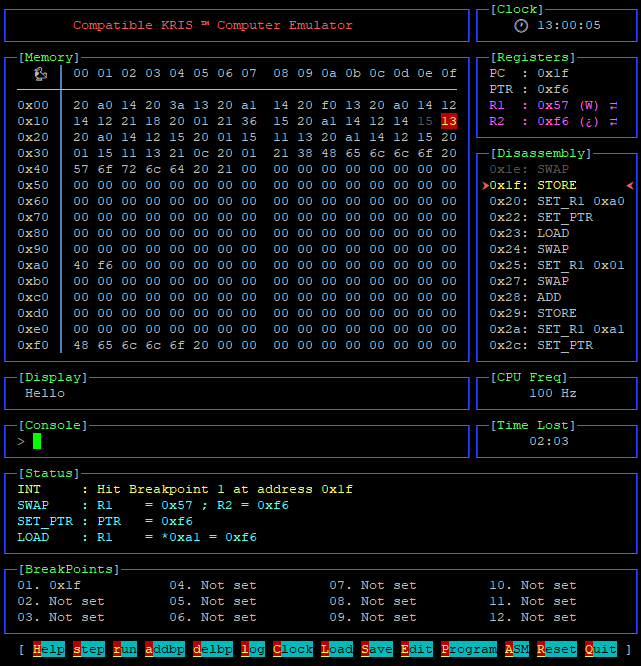
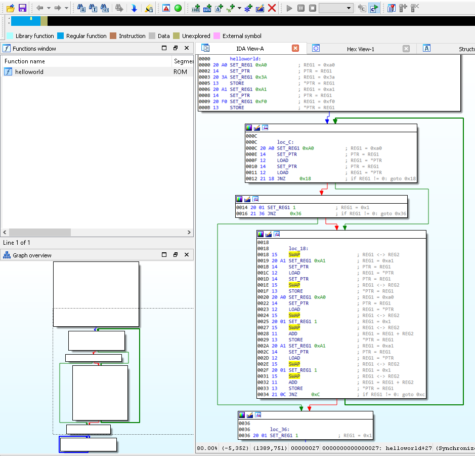

# KRIS ™ Computer Architecture Manual

## Authors
*  Architecture: Benoit Sevens   - [@benoitsevens](https://twitter.com/benoitsevens)  - [b3n7s.github.io](https://b3n7s.github.io/)
*  Debugger/VM : Benjamin Evrard - [@tsunulukai 🦆](https://twitter.com/tsunulukai) - [adelpha.be](https://adelpha.be/)
*  IDA Pro CPU Module: anonymous contributor

## Description
The KRIS (acronym of "Kleine Ridikule Inefficiente Systeem") is an exotic, but sexy 8-bit computer architecture.

## Usage

Usage:

    ./kris_vm.py [options] [[-a] <program>]

Options:

    -l <logfile>    Log file (defaults to computer.log)
    -d              Enable KRIS display at startup
    -a              Program file is in KRIS asm
    <program>       Program to load

    Example:
    ./kris_vm.py    helloworld.kris  -l helloworld.log -d
    ./kris_vm.py -a helloworld.krisa -l helloworld.log -d

## Registers

There are 4 registers:

    ┌──────┬─────────────────────────────────────────────────────────────────┐
    │ REG1 │ General-Purpose Register 1                                      │
    │      │ Contains data that can be read from or written to memory        │
    │ REG2 │ General-Purpose Register 2                                      │
    │ PTR  │ Pointer                                                         │
    │      │ Contains a memory pointer where data can be read or written     │
    │ PC   │ Program Counter                                                 │
    │      │ Points to the next instruction to be executed                   │
    └──────┴─────────────────────────────────────────────────────────────────┘

Each register is 8 bits long.

## Opcodes Reference Table

Each opcode is either 1 or 2 byte(s) long.

For 1 byte long opcodes, the byte gets the value of the opcode.

For 2 byte long opcodes:

 - The 1st byte gets the value of the opcode;
 - The 2nd byte gets the value of the argument.

Opcodes:

    ┌───────────────────┬───────┬──────────────┬─────────────────────────────┐
    │ Mnemonic          │ Value │ instruction  │ Pseudocode                  │
    │                   │       │ size (bytes) │                             │
    ├───────────────────┼───────┼──────────────┼─────────────────────────────┤
    │ HALT              │ 0x0F  │ 1            │ Halts the CPU               │
    │ XOR               │ 0x10  │ 1            │ REG1 = REG1 ^ REG2          │
    │ ADD               │ 0x11  │ 1            │ REG1 = REG1 + REG2          │
    │ LOAD              │ 0x12  │ 1            │ REG1 = *PTR                 │
    │ STORE             │ 0x13  │ 1            │ *PTR = REG1                 │
    │ SET_PTR           │ 0x14  │ 1            │ PTR = REG1                  │
    │ SWAP              │ 0x15  │ 1            │ REG1 <-> REG2               │
    │                   │       │              │                             │
    │ SET_REG1 constant │ 0x20  │ 2            │ REG1 = constant             │
    │ JNZ constant      │ 0x21  │ 2            │ if REG1 != 0: goto constant │
    └───────────────────┴───────┴──────────────┴─────────────────────────────┘

## Memory Layout

The computer has 256 bytes of RAM, which can be addressed with addresses
ranging from 0 to 255.

The computer program gets loaded (mapped) at address 0.

There is a small screen attached to the computer which can display 16
characters. This screen is memory mapped to the last 16 bytes of the RAM.
Writing to this area of RAM (addresses 0xf0 - 0xff), displays a character
on the corresponding position of the screen.

## Boot/Reset Process

All registers (PC included) are initialised to 0 at boot or a reset.
Execution starts at address 0.
The Program Counter (PC) is automatically incremented with 1 or 2 bytes
after each instruction, according to the length of the executed
instruction.

## Debugger's Commands

The debugger supports the following commands:

    ┌─────────────┬──────────────────────────────────────────────────────────────────┐
    │ Command     │ Description                                                      │
    ├─────────────┼──────────────────────────────────────────────────────────────────┤
    │ (s)tep      │ Executes a single instruction; it's the default command          │
    │ (r)un       │ Executes instructions until interrupted by user/breakpoint       │
    │ (a)ddbp     │ Adds an execution breakpoint at an address of your choice        │
    │ (d)elbp     │ Removes a breakpoint                                             │
    │ (l)og       │ Displays the last n lines of the status/trace log                │
    │ (m)an       │ Displays the current manual                                      │
    │ (q)uit      │ Exits the debugger                                               │
    │ (c)lear     │ Clears and refreshes the screen                                  │
    │ (C)lock     │ Change the CPU clock speed                                       │
    │ (D)isplay   │ Toggles the KRIS display (hex/ascii views)                       │
    │ (L)oad      │ Loads a program from disk                                        │
    │ (P)rogram   │ Enters programming mode; allows you to edit memory content       │
    │ (A)ssemble  │ Enters assembly mode; allows you to input KRIS ASM instructions  │
    │             │ In this mode, you can use the keyword 'address_xxh:' to indicate │
    │             │ at which offset your assembly bloc begins                        │
    │ (R)eset     │ Resets the KRIS computer                                         │
    │ (S)ave      │ Saves a program to disk until specified memory address           │
    │ (E)dit      │ Edits a Register/Memory value                                    │
    └─────────────┴──────────────────────────────────────────────────────────────────┘

## IDA Pro Processor Module

An IDA Pro 7.1 CPU module has also been developped for the KRIS Architecture.

To install the module in IDA, just copy the `kris_ida.py` file in `<IDA-PRO-Folder>\procs\kris.py`

To disassemble a KRIS program in IDA:
- File / Open;
- Select a KRIS binary file;
- Load as "Binary file" with the Processor type set to "KRIS 8-bit computer [kris]";
- Leave the default setting in the "Disassembly memory organization" window;
- At offset 0, press "c" to disassemble the KRIS binary into KRIS ASM;
- Select the instruction bytes and press "p" to create a function.

If you enable auto-comments, you'll get pseudocode next to the KRIS ASM instructions.

